  

## 📌 About Me
- Hi, I'm Manoj Kumar 👋
- 🎓 I am a Bachelor of Computer Applications (BCA) student specializing in Artificial Intelligence and Machine Learning (AI & ML)
- 🏫 Studying at Lovely Professional University (LPU), Phagwara, Punjab, India
- 📍 Originally from Mathura, Uttar Pradesh, India
- 💻 Currently learning and exploring new technologies in AI, ML, and development
- 🚀 Building projects to improve my practical skills
- 🤝 Open to collaboration on innovative and meaningful projects
- 📚 Always eager to learn and grow in the tech field

## 🧠 My Focus Areas
- Building Real-World Projects
- AI & ML
- Python Development
- Learning New Technologies

## 📊 GitHub Stats & Trophies

  
  

  

  

  

## 🛠️ Languages & Tools

<h3 align="center">Programming Languages</h3>

  &nbsp;
  &nbsp;
  &nbsp;
  

<h3 align="center">Frontend</h3>

  &nbsp;
  

<h3 align="center">Database</h3>

  &nbsp;
  &nbsp;
  

<h3 align="center">DevOps & Cloud</h3>

  &nbsp;
  

<h3 align="center">Tools</h3>

  &nbsp;
  

  

 

## 🔗 Connect with Me

  &nbsp;&nbsp;&nbsp;&nbsp;&nbsp;&nbsp;&nbsp;
  

  

  

